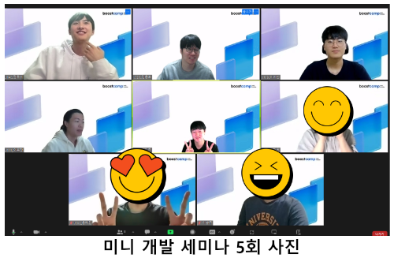

  
  

  

# 🍀web12-algo-with-me

Algo With Me는 **모두가 참여하고 만들 수 있는 알고리즘 대회 서비스**입니다.

주요 기능은 다음과 같습니다.

- 사용자가 제출한 코드를 채점할 수 있습니다
- 실시간으로 대회에 참여한 경쟁자들의 순위를 확인할 수 있습니다
  

  

## 📄목차

- [데모 영상](#데모-영상)
- [Algo With Me 기능 설명](#Algo-With-Me-기능-설명)
- [문제 해결 과정](#문제-해결-과정-배경)
- [미니 개발 세미나](#미니-개발-세미나)
- [아키텍처](#아키텍처)
- [기술스택](#기술스택)
- [디자인 및 기획](#디자인-및-기획)
- [기타 등등](#기타-등등)
- [팀원 소개](#팀원-소개)

  

## 🎬데모 영상

https://github.com/boostcampwm2023/web12-algo-with-me/assets/39542757/a5462276-4751-45b9-86ee-6dfebec1c629

[유튜브 바로가기](https://www.youtube.com/watch?v=gAqy29KDXzQ)

  

## 🚀Algo With Me 기능 설명

### 코드 채점하기

대회 페이지는 
- 문제 화면
- 코드를 작성할 수 있는 에디터
- 제출 결과 화면

으로 구성됩니다.  
나만의 테스트 케이스를 추가하고 "테스트 실행"버튼을 눌러 실행할 수 있습니다.  
"제출하기" 버튼을 누르면 히든 테스트 케이스들의 정답 여부와 시간, 메모리 사용량을 받아볼 수 있습니다.  

### 대시 보드 확인

대회 참여자 순위 100위까지와, 나의 순위를 대회 진행 중 실시간으로 확인할 수 있습니다.  
대회 참여자가 아니라도 대시보드를 확인할 수 있습니다.

### 그 외

  

    <h3>메인 페이지</h3>
  

      
    
algo-with-me 메인페이지입니다. 현재까지의 모든 대회를 확인할 수 있습니다.

  

    <h3>대회 생성</h3>
  

      
    
대회 생성 페이지 입니다. 최대 참여인원 설정이 가능하고 대회 시간을 지정할 수 있습니다. 등록된 문제를 선택해 대회에 포함시킬 수 있습니다. 

  

    <h3>대회 상세 페이지</h3>
  

      
    
대회 상세 페이지에서는 대회의 시작, 종료 시간, 참가자 등의 정보를 얻을 수 있습니다. 대회 시작 시간이 되면 대회 입장 버튼과 대시보드 보기 버튼이 활성화됩니다. 

  

    <h3>테스트 케이스 추가</h3>
  

      
    
제출하기 전 테스트 케이스를 추가하고 내 코드를 실행해볼 수 있습니다.

  

## 🥚문제 해결 과정: 배경

저희 팀에게 주어진 자원은 2코어, 8GB RAM 네이버 클라우드 인스턴스 하나였습니다.  
하지만 부스트캠프 전원(200명)이 참여할 수 있는 서비스를 만들고 싶었습니다.

그래서 **가진 자원을 어떻게 해야 최대한으로 활용할 수 있을까** 라는 도전과제를 목표로 설정하게 되었습니다.

 

## 🐣문제 해결 과정: 시도한 것들

### BE) 아키텍처 설계 최적화

> 어떻게 많은 채점 요청이 들어오더라도 누락 없이 모두 채점할 수 있을까?  
> 어떤 기술을 사용해야 우리 문제를 해결하는 데에 유리할까?
> 
> [👉 BE 아키텍처 설계 및 DB ERD 설계](https://glacier-aura-f95.notion.site/BE-DB-ERD-714ca93a27524c478aa7e2cebd155995)  
> [👉 기술 스택 선정](https://www.notion.so/546cc227d80c4f34ac521e6b0ccdb843?v=870210cc83464a3fa18885cd237bf132&p=c4d9dfa965cd421a866844356d47b693&pm=s)

### BE) 채점 로직

> 병렬적으로 채점하려면 어떻게 구조를 짜야 할까?  
> 보안 위협 없이 안전하게 채점할 수 있을까?
> 
> [👉 채점서버, 도커서버 실행흐름](https://www.notion.so/API-websocket-b68c13dd6eb44a7fa72492ce7cde14e3?p=fbc4ada36c634e52804c32b125bddc38&pm=s)  
> [👉 BE 채점서버 아키텍처 관련 회의](https://www.notion.so/BE-0efb2000a49b454098e8b897a757d537)

### BE) 대시보드

> 폴링, 웹 소켓, SSE 무엇을 사용해야 할까?  
> DB, 메모리 자원을 어떻게 효율적으로 활용할 수 있을까?  
> 어떻게 해야 서버 부담을 줄이면서도 실시간으로 데이터를 전달할 수 있을까?
> 
> [👉 대시보드 데이터 redis 저장 방식, 클라이언트에게 보낼 양식, db 저장 방식](https://www.notion.so/redis-db-cbad1774de6b4653bbacd3078d1b9c27)  
> [👉 대시보드 소켓 재사용 관련 회의](https://glacier-aura-f95.notion.site/9e3419df17834e5db1cc05d7040a5641)

### FE) 클라이언트에서 JS 코드를 테스트할 수 있을까?

> 어떻게 해야 서버로 가는 요청을 줄여서 리소스를 아낄 수 있을까?  
> 채점은 몰라도 테스트 정도는 클라이언트에서 돌려도 되지 않을까?  
> Eval을 사용하면 될 것 같긴 한데, Eval을 써도 될까?
> 
> [👉 eval을 사용해선 안 되는 이유와 대안들](https://www.notion.so/eval-8c82867d1ee94e9f88fb9d6e33859c98?pvs=4)

### FE) Eval은 안전할까? 어떻게 해야 안전해질까
> Eval을 사용하면 무한 루프를 만났을 때 메인 스레드가 멈추는 문제가 생긴다.  
> 웹 워커를 이용해서 스레드를 분리해 보자
>
> [👉 웹 워커란 무엇인가? & 알고윗미에서의 활용 방안](https://www.notion.so/e260a21a377c43fa893f4834cc786bd4?pvs=4)  

> Eval은 언제 위험할까?  
> Eval은 사이드 이펙트가 발생할 때 위험해  
> 사이드 이펙트가 일어날 수 없는 순수한 JS 엔진을 올려서 사용해 보자  
>
> [👉 웹 어셈블리란 무엇인가? & 알고윗미에서의 활용 방안](https://www.notion.so/8172c191ef504137bc494b1c6fa07e87?pvs=4)

### FE) QuickJS는 엄밀한가?

> QuickJS라는 JS 엔진을 사용하면 될 것 같아.  
> 하지만 이게 정말 모든 브라우저에서 공평하게 동작할까?  
>
> [👉 [검증] QuickJS는 모든 브라우저에서 동일한 성능을 보장할 수 있는가?](https://www.notion.so/QuickJS-10f196d0d4b04e0a98132aeec5b4ba9a?pvs=4)  
> [👉 [검증] QuickJS는 모든 브라우저에서 동일한 Max Call Stack을 보장할 수 있는가?](https://www.notion.so/QuickJS-Max-Call-Stack-2997c58c2f3146d5b7ca372cd9ce5ff4?pvs=4)  

### FE) 공정한 환경을 구성하기 위해선 서버와 클라이언트의 시간을 동기화해야 한다

> 참여자들은 시험이 정확하게 같은 시간에 시작하고 같은 시간에 끝나기를 기대한다.  
> 이를 위해서 서버와 클라이언트의 시간을 동기화해야 하는데, 어떻게 할 수 있을까?  
> 서버 자원이 무한하다면 1초마다 Http 요청을 보내면 되지만, 서버 자원은 한정되어 있다.  
> 클라이언트의 Date 객체만으로는 서버와 시간 동기화할 수 없을까?
>
> [👉 Date 내장 객체는 믿을만한가?](https://www.notion.so/Date-420fc688054d4561a37eb6b8e92c257c?pvs=4)

> 브라우저의 Date 내장 객체로는 엄밀한 시간 동기화가 불가능해  
> 5초 간격으로 시간을 갱신해주는 정도로 요청을 최소화해볼 수 있을까?  
> setInterval은 얼마나 믿을 수 있을까?  
>
> [👉 setInterval은 메인스레드가 바빠도 정확하게 동작할까?](https://www.notion.so/setInterval-bfd9642de1b14922bf6a5b3766d00b13?pvs=4)

 

## 🐓문제 해결 과정: 트러블 슈팅

### BE) 대시보드 데이터 관리를 위한 Redis 설치 과정에서 겪은 트러블슈팅

> 대시보드 데이터 관리를 위해 Redis를 설치하려고 했다.  
> NestJS에서 제공하는 cache-module을 사용했는데, Redis에 특화된 자료구조를(e.g. SortedSet) 제어하는 명령어를 사용할 수 없었다.  
> redis-client를 설치하여 문제를 해결했다.
>
> [👉 대시보드 데이터 관리를 위한 Redis 설치 과정에서 겪은 트러블슈팅](https://www.notion.so/Redis-e06fd0c4c1f345279173fede2d837bb2?pvs=4)

### BE) 트랜잭션과 락 관련 트러블슈팅

> 일부 채점 결과가 누락되는 문제가 발생했다.  
> 채점이 병렬적으로 진행되어 API 서버에 요청이 거의 동시에 들어왔고, 경쟁 조건이 발생했기 때문이었다.  
> 트랜잭션을 걸었지만, 문제는 해결되지 않았고, 락을 건 이후에야 제대로 동작했다.
>
> [👉 도커 서버 개수 5개로 늘린 이후 일부 채점 결과가 누락되는 문제](https://www.notion.so/5-e744910299ad4defbc5b3ba4fe81c939)

### BE) 도커 권한 관련 트러블슈팅

> 기존에는 root 사용자로 모든 서버를 운영하고 있었다.  
> 보안상의 이유로 코드 실행 서버의 유저 권한을 root에서 일반사용자로 바꾸었는데, 권한이 줄어들어 파일 읽기 쓰기가 되지 않는 문제가 발생했다.  
> 도커 유저 설정을 통해 API 서버와 채점 서버의 권한을 일반 사용자로 바꾸어 문제를 해결했다.
> 
> [👉 채점서버 도커 권한으로 인한 읽기/쓰기 불가 문제](https://www.notion.so/Docker-faf0cbe16a014ad68352f77019160a6d)

### FE) useEffect, 생명주기를 알고 쓰자

> socket으로 데이터를 받아 대시보드를 모달로 보여줘야지  
> 모달을 닫고 다시 열면 데이터가 정상적으로 수신되지 않아  
> 페이지에서는 정상 작동하는데, 모달에서는 왜 작동하지 않을까?  
>
> [👉 [트러블 슈팅] useEffect, 생명주기를 알고 쓰자](https://www.notion.so/useEffect-affad237ee9d42dfbb8fac96dea42ad1)

### FE) 싱글톤 패턴을 이용한 웹소켓 다중 연결 상태 해결
> 통신 오버헤드를 줄이기 위해 웹 소켓을 사용하기로 결정했다.  
> 개발자 도구로 웹 소켓 연결을 확인하니 10개의 웹 소켓이 연결되는 것을 확인했다.  
> 무엇이 문제고, 어떻게 해결해 나가야할까?
>
> [👉 [트러블 슈팅] 싱글톤 패턴을 이용한 웹소켓 다중 연결 상태 해결](https://www.notion.so/f456ba08982b46539731dbcd98b8d97c)

### FE) 배포하고 새로고침하면 404페이지가 떠요

> Netlify에 웹페이지는 배포를 마쳤다.  
> 하지만 메인 페이지를 제외한 다른 페이지에서 새로고침을 하면 404 페이지가 나오는 문제를 겪게 된다.  
> 개발 환경과 배포 환경은 무엇이 달라 이런 문제가 생겼을까? 어떻게 해결할 수 있을까?   
>
> [👉 [트러블 슈팅] 배포하고 새로고침하면 404페이지가 떠요](https://www.notion.so/404-d6cac3477bf14ce59be66d468d5bb413?pvs=4)

 

## 🍗문제 해결 과정: 결과

### BE) 부하 테스트 결과

> JMeter로 부하테스트를 수행하여 부스트캠프 전 인원이 우리 서비스를 이용할 수 있을지 알아보았다.  
> 200명이 동시에 `WebSocket`을 통해 대시보드 데이터를 원활하게 받을 수 있음을 확인하였다.  
> 그리고, 100명이 0~10초 균등확률분포로 코드 제출 요청을 보냈을 때, 채점을 원활하게 할 수 있음을 확인했다.
>
> [👉 부하 테스트 수행 및 결과 정리](https://www.notion.so/9332afb487ff419fae2b65362ee83fad)

  

## 👨‍👨‍👧‍👧미니 개발 세미나

  

> **미니 개발 세미나란?**
>
> 미니 개발 세미나는 *Web12 코드 사피엔스*팀 내부에서 공유 문화를 만들기 위해 시작된 소규모 세미나입니다.
> 5 ~ 10분 동안 자유주제 혹은 프로젝트를 진행하면서 공유하고 싶은 내용을 발표하는 방식으로 진행됩니다.
> 발표자는 팀원들로 구성되지만, 다른 캠퍼들도 자유롭게 듣고 질문할 수 있도록 외부적으로 공개하였습니다.
> 2023/11/08 첫 세미나를 시작으로 5회 진행되었으며, **부스트캠프가 끝나고도 이어갈 예정입니다.**
>
> [👉 전체 보기](https://glacier-aura-f95.notion.site/6d5e29ae5be3417eb3e963e434b8ec0e?v=9b187ad6575f4eb28de3aa5ee78d6076&pvs=4)  

### Best Pick
| 썸네일 | 한 줄 소개 | 링크 |
|------|------|------|
|  | 제가 개발자의 길을 걷게 되면서 스스로 가지고 있던 개발자의 정의가 어떻게 바뀌었는지 회고하고 질문을 던집니다 | [그대들 어떻게 개발할 것인가?](https://www.notion.so/9984ebe33b084b87928c1d58e6c03ee3?pvs=4) |
|  | 양방향 통신들의 기법에 대해서 간략히 알아보고, 왜 우리가 webSocket을 선택했는지 공유합니다. | [WebSocket을 선택한 이유](https://www.notion.so/Algo-With-Me-webSocket-fc2156159b4149f28d21ccd89191dca1) |
|  | 클린 코드를 왜 지향해야 하는지, 클린 코드와 주석의 상관관계는 무엇인지에 대해 설명합니다. | [클린 코드, 주석](https://www.notion.so/4cbd33cf9de14ea4aed81b56691e256f) |
|  | MicroService Architecture가 무엇인지, 어떤 장점이 있는지, 언제 사용해야 하는지 살펴봅니다. | [Why MSA?](https://www.notion.so/Why-MSA-970268092045436aa0af6c36f134d675?pvs=4) |
|  | 대시보드 실시간 갱신을 위해 WebSocket과 Redis를 도입하여 사용하게 된 과정을 소개합니다. | [대시보드 어떻게 구현하지](https://glacier-aura-f95.notion.site/82bc461a68464a9cb0bc7dd8aa5e9f1e?pvs=4) |

  

## 👷🏻‍♂️아키텍처

[아키텍처](https://www.figma.com/file/Muux6igNnXxpQ2wvXhuuL2/%EC%95%84%ED%82%A4%ED%85%8D%EC%B2%98?type=whiteboard&node-id=0-1&t=71bPh0VNrNYTWHA5-0)

  

## 🛠️기술스택

### Language

### BE Skill

### FE Skill 

### Etc

  

## 🎸디자인 및 기획

- [스토리맵&백로그](https://www.figma.com/file/gWCcjBIjAStADIuIHnZuFD/%EC%8A%A4%ED%86%A0%EB%A6%AC%EB%A7%B5-%26-%EB%B0%B1%EB%A1%9C%EA%B7%B8?type=whiteboard&t=dtVUyaIFru4GF6Ts-0)
- [목업 디자인](https://www.figma.com/file/V42mrxheeNAvLQMbbvrZli/%EB%94%94%EC%9E%90%EC%9D%B8?type=design&node-id=0-1&mode=design&t=nggZ8AcV0QhK633S-0)
- [프로토타입 디자인](https://www.figma.com/file/V42mrxheeNAvLQMbbvrZli/%EB%94%94%EC%9E%90%EC%9D%B8?type=design&node-id=0-1&mode=design&t=nggZ8AcV0QhK633S-0)

  

## 🎸기타 등등

- [회의록](https://www.notion.so/f19790de606742fcbb3f3ac5f0f13934?pvs=4)
- [회고](https://glacier-aura-f95.notion.site/2ef691d35dcc47758b4b4a6a774426ea?pvs=4)
- [헙업전략](https://glacier-aura-f95.notion.site/98aa163e43f143ba964b5a2e11ad85ea?pvs=4)

  

## 🙉팀원 소개

|                                                                    FE                                                                    |                                                                       FE                                                                       |                                                                  FE                                                                   |                                                                     BE                                                                      |                                                                        BE                                                                         |
| :--------------------------------------------------------------------------------------------------------------------------------------: | :--------------------------------------------------------------------------------------------------------------------------------------------: | :-----------------------------------------------------------------------------------------------------------------------------------: | :-----------------------------------------------------------------------------------------------------------------------------------------: | :-----------------------------------------------------------------------------------------------------------------------------------------------: |
|     **J079 양기조**   ([dev2820](https://github.com/dev2820)) |     **J111 이우찬**   ([dmdmdkdkr](https://github.com/dmdmdkdkr)) |     **J140 정유석**   ([mahwin](https://github.com/mahwin)) |     **J026 김용후**   ([rladydgn](https://github.com/rladydgn)) |     **J109 이예찬**   ([yechan2468](https://github.com/yechan2468)) |
